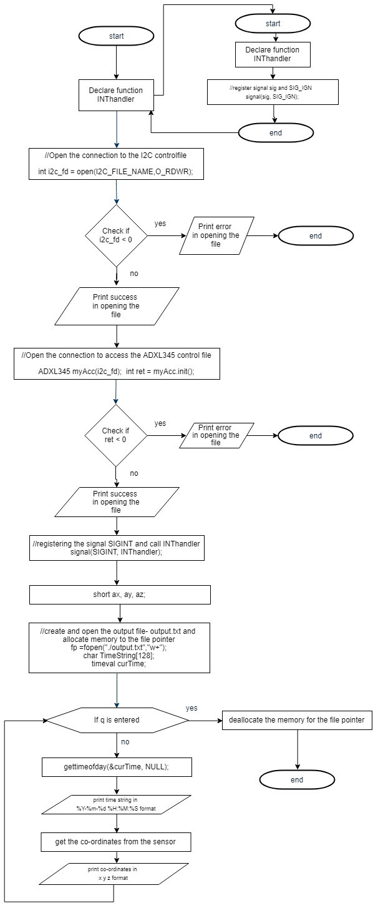

# IoT_MotionDectection

Build a motion detection system with the use of a raspberry pi single board computer, in which the sensing data from the Adafruit ADXL345 motion sensor is transmitted to a server using client server communication. The data from the sensor is encrypted and sent from the raspberry pi to the server by incorporating a UDP connection with either a SPI bus or a I2C bus. In the server the data is then decrypted and displayed graphically.

Raspberry Pi is a compact single-board computer that was developed by the Raspberry Pi Foundation in UK to teach of basics of computers in schools and all developing countries. The name Raspberry Pi original model became very popular than expected and was sold outside its target market for robotics and other applications. It is a single boarded CPU and does not include other accessories such as keyboards and mouse.
	Raspberry Pi is used by computer amateurs, teachers, elementary school students and small businesses. It is pre-installed with Linux system called Raspbian. It is only a credit card size, equipped with an ARM architecture processor, and its computing performance is like that of a basic smartphone.
 The Raspberry Pi provides a USB interface for the mouse and keyboard, in addition to the Fast Ethernet interface, SD card expansion interface and an HDMI high-definition video output interface, which can be connected to the display or TV.
The Raspberry Pi Model that we are using has the following specs.
        •	Broadcom BCM2837B0, Cortex-A53 (ARMv8) 64-bit SoC @ 1.4GHz
        •	1GB LPDDR2 SDRAM
        •	2.4GHz and 5GHz IEEE 802.11.b/g/n/ac wireless LAN, Bluetooth 4.2, BLE.
        •	Gigabit Ethernet over USB 2.0 (maximum throughput 300 Mbps)
        •	Extended 40-pin GPIO header
        •	Full HDMI
        •	4 USB 2.0 ports
        •	CSI camera port for connecting a Raspberry Pi camera
        •	DSI display port for connecting a Raspberry Pi touchscreen display
        •	4-pole stereo output and composite video port
        •	Micro SD port for loading your operating system and storing data
        •	5V/2.5A DC power input
        •	Power-over-Ethernet (PoE) support (requires separate PoE HAT)
  

